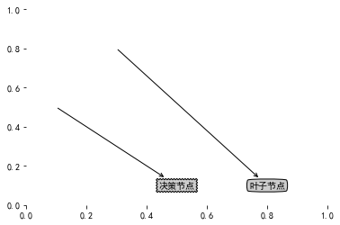

## 决策树实践

### 简介
>机器学习中，决策树是一个预测模型；他代表的是对象属性与对象值之间的一种映射关系。树中每个节点表示某个对象，而每个分叉路径则代表某个可能的属性值，而每个叶节点则对应从根节点到该叶节点所经历的路径所表示的对象的值。决策树仅有单一输出，若欲有复数输出，可以建立独立的决策树以处理不同输出。 数据挖掘中决策树是一种经常要用到的技术，可以用于分析数据，同样也可以用来作预测。
从数据产生决策树的机器学习技术叫做决策树学习,通俗说就是决策树。 ----摘自[维基百科](https://zh.wikipedia.org/wiki/%E5%86%B3%E7%AD%96%E6%A0%91)

### 优缺点及适用数据类型
> 
  - 优点：计算复杂度不高，输出结果容易理解，对中间值的缺失不敏感，可以处理不相关特征数据。
  - 缺点：可能会产生过度匹配
  - 适用数据类型：数值型和标称型

### 决策树构造
  
  决策树的主要思想就是对数据集按照一定的规则进行划分，其大致的算法流程伪码如下：
  
```
  def createBranch():
      if 数据集中每一个样本都属于同一分类：
          return 类别标签
      else:
          找到最先用来划分数据集的特征
          划分数据集
          创建分支节点
              for 每个数据子集：
                  调用createBranch()
          return 分支节点
       
``` 
  因此在构造决策树时最主要的问题就是找到当前数据集中用来最先进行划分数据集的特征，也就是说在将数据集分类时，我们应该先根据哪个特征来进行划分，这里可以将这个特征成为最优特征。关于最优特征目前有很多算法。
>常用决策树算法有ID3，C4.5和CART。它们都是采用贪心（即非回溯的）方法，自顶向下递归的分治方法构造。这几个算法选择属性划分的方法各不相同，ID3使用的是信息增益，C4.5使用的是信息增益率，而CART使用的是Gini基尼指数。

### 常用算法及Python实现
*下面只对ID3算法进行代码实现。*
#### ID3算法
>ID3算法（Iterative Dichotomiser 3 迭代二叉树3代）是一个由Ross Quinlan发明的用于决策树的算法。
这个算法是建立在奥卡姆剃刀的基础上：越是小型的决策树越优于大的决策树（简单理论）。尽管如此，该算法也不是总是生成最小的树形结构。而是一个启发式算法。奥卡姆剃刀阐述了一个信息熵的概念：$$I_E(i)=-\sum_{j=1}^{m}f(i,j)log_2f(i,j))$$


>熵被用来衡量一个随机变量出现的期望值。熵越大，一个变量的不确定性就越大（也就是可取的值很多），把它搞清楚所需要的信息量也就越大，熵是整个系统的平均消息量。 信息熵是信息论中用于度量信息量的一个概念。一个系统越是有序，信息熵就越低；反之，一个系统越是混乱，信息熵就越高。所以，信息熵也可以说是系统有序化程度的一个度量。

##### 熵（Entropy）的计算公式

>熵定义为信息的期望值。先看看信息的定义：

>$$l(x_i)=−log_2p(x_i)$$

>其中，$p(x_i)$是选择该分类的概率。对D中的元组所有分类所有可能值的信息期望，即熵，计算公式如下：

>$$Entropy=H(D)=E(I(D))=−\sum_{i}^{n}p_ilog_2(p_i)$$ $p_i$是D中任意元组属于类$C_i$非零概率。
熵越大，说明系统越混乱，携带的信息就越少。熵越小，说明系统越有序，携带的信息就越多。信息的作用就是在于消除不确定性。

>ID3划分特征使用的就是信息增益IG。一个属性的信息增益越大，表明属性对样本的熵减少的能力就更强，该属性使得数据所属类别的不确定性变为确定性的能力越强。信息增益在统计学中称为互信息，互信息是条件概率与后验概率的比值，化简之后就可以得到信息增益。所以说互信息其实就是信息增益。计算方法【互信息=熵-条件熵】。熵描述的是不确定性。熵越大，不确定性就越大，条件熵H（B|A）描述的是在A给定的条件下B的不确定性，如果条件熵越小，表示不确定性就越小，那么B就越容易确定结果。所以使用熵减去条件熵，就得到了信息增益，他描述的不确定性的降低程度，可以用来度量两个变量的相关性。比如，在给定一个变量的条件下，另一个变量它的不确定性能够降低多少，如果不确定性降低得越多，那么它的确定性就越大，就越容易区分，两者就越相关。注：期望信息越小，分区的纯度越高。

##### 信息增益计算

>首先计算特征A对数据集D的经验条件熵H(D|A),在数学上就是条件概率分布（Condition Probability）.

>$$H(D|A)=\sum_{j}\cfrac{|D_j|}{|D|}×H(D_j)$$，项$\cfrac{|D_j|}{|D|}$充当第j个分区的权重
引入条件熵，在信息论中主要是为了消除结果的不确定性。然后计算信息增益

>$$Gain(A)=H(D)−H(D|A)$$
其中，Gain(A)即为所求的信息增益。

##### 代码实现
###### 创建产生测试数据的方法
测试数据如下表“海洋生物数据”所示，为了方便处理将两个特征的“是”和“否”分别用“1”和“0”代替，分类标签的“是”和“否”分别用“yes”和“no”代替。

|序号|不浮出水面是否可以生存|是否有脚蹼|属于鱼类|
|:-:|:-:|:-:|:-:|:-:|
|1|是|是|是|
|2|是|是|是|
|3|是|否|否|
|4|否|是|否|
|5|否|是|否|


```python
def create_data_set():
    data_set = [
        [1, 1, 'yes'],
        [1, 1, 'yes'],
        [1, 0, 'no'],
        [0, 1, 'no'],
        [0, 1, 'no']
    ]
    labels = ['no surfacing', 'flippers']
    return data_set, labels
data_set, data_labels = create_data_set()
print(data_set)
print(data_labels)
```

    [[1, 1, 'yes'], [1, 1, 'yes'], [1, 0, 'no'], [0, 1, 'no'], [0, 1, 'no']]
    ['no surfacing', 'flippers']
    

###### 计算给定数据集的信息熵


```python
from math import log
def calc_entropy(data_set):
    num_data = len(data_set)
    label_counts = {}
    for data in data_set:
        current_label = data[-1]
        if current_label not in label_counts.keys():
            label_counts[current_label] = 0
        label_counts[current_label] += 1
    entropy = 0.0
    for key in label_counts:
        prob = float(label_counts[key])/num_data
        entropy -= prob * log(prob, 2)
    return entropy
entropy = calc_entropy(data_set)
entropy
```


    0.9709505944546686


##### 创建划分数据集方法


```python
def split_data_set(data_set, axis, value):
    re_data_set = []
    for data in data_set:
        if data[axis] == value:
            re_data = data[:axis]         # 将data列表中该特征之前的特征放到re_data列表中
            re_data.extend(data[axis+1:]) # 将data列表中该特征之后的特征也放到re_data中，说白了就是剔除了特征值为value的特征
            re_data_set.append(re_data)
    return re_data_set
# 测试
print("data_set：", data_set) # 再次打印上文的data_set
re_data = split_data_set(data_set, 0, 1)
print("re_data：", re_data)
```

    data_set： [[1, 1, 'yes'], [1, 1, 'yes'], [1, 0, 'no'], [0, 1, 'no'], [0, 1, 'no']]
    re_data： [[1, 'yes'], [1, 'yes'], [0, 'no']]
    

从上述结果可以看出，我们在data_set数据集中将每个样本里符合第1个（即索引为0的）特征的值为1的样本提取出来了。

##### 创建选择最优特征方法


```python
def choose_best_feature(data_set):
    num_feature = len(data_set[0]) - 1  # 这里减一是因为每个样本中最后一个值是标签，而不是特征值
    num_data = len(data_set)
    data_set_entropy = calc_entropy(data_set)
    gain = 0.0
    best_feature = -1
    for i in range(num_feature):  
        feature_list = [example[i] for example in data_set]
        unique_values = set(feature_list)
        new_entropy = 0.0
        for value in unique_values:
            re_data_set = split_data_set(data_set, i, value)
            prob = len(re_data_set)/float(num_data)
            new_entropy += prob * calc_entropy(re_data_set)
        new_gain = data_set_entropy - new_entropy
        if new_gain > gain:
            gain = new_gain
            best_feature = i
    return best_feature
```

继续使用上文的data_set进行数据测试：


```python
data_set
```


    [[1, 1, 'yes'], [1, 1, 'yes'], [1, 0, 'no'], [0, 1, 'no'], [0, 1, 'no']]


```python
best_feature = choose_best_feature(data_set)
best_feature
```


    0


##### 递归创建决策树
决策树递归结束的条件为下列两种情况：
1. 遍历完所有划分数据集的特征
2. 每个分支下的所有样本实例都具有相同的分类

注：对于第一点，当遍历完所有特征后，如果发现子数据集中仍有多种标签分类，则采用少数服从多数的原则将该子集进行分类。下面的majority_class方法表达的就是这个意思。


```python
import operator
def majority_class(class_list):
    class_count = {}
    for cla in class_list:
        if cla not in class_count.keys():
            class_count[cla] = 0
        class_count[cla] += 1
    sorted_class_count = sorted(class_count.items(), key=operator.items(1), reverse=True)
    return sorted_class_count[0][0]
```

解决完递归结束条件后，开始正式创建决策树：


```python
def create_tree(data_set, data_labels):
    labels = data_labels[:] # 防止改变原data_labels列表
    class_list = [example[-1] for example in data_set]
    # 符合递归结束条件2
    if class_list.count(class_list[0]) == len(class_list):
        return class_list[0]
    # 符合递归结束条件1
    if len(data_set[0]) == 1:
        return majority_class(class_list)
    # 计算并获取最优特征 
    best_feature = choose_best_feature(data_set)
    best_feature_label = labels[best_feature]
    decision_tree = {best_feature_label: {}}
    del(labels[best_feature])
    feature_values = [example[best_feature] for example in data_set]
    unique_values = set(feature_values)
    for value in unique_values:
        sub_labels = labels[:]
        decision_tree[best_feature_label][value] = create_tree(split_data_set(data_set, best_feature, value), sub_labels)
    return decision_tree
    
```

上述代码首先创建class_list列表，其中包含了数据集的所有分类标签。通过对class_list列表的进行两步判断，看是否符合两个递归结束条件中的任意一个。接下来开始创建决策树，先获取最优特征，以及该特征的所有特征值，并将最优特征从特征标签中删除。根据特征值划分子集，对每个子集递归调用create_tree。为了在递归时不改变原data_labels，所以使用新变量labels代替原始列表，sub_labels的道理类似。

##### 下面进行测试输出：


```python
# 测试数据
data_set, data_labels
```


    ([[1, 1, 'yes'], [1, 1, 'yes'], [1, 0, 'no'], [0, 1, 'no'], [0, 1, 'no']],
     ['no surfacing', 'flippers'])


```python
# 创建决策树
dt = create_tree(data_set,data_labels)
dt
```


    {'no surfacing': {0: 'no', 1: {'flippers': {0: 'no', 1: 'yes'}}}}


##### 测试算法：使用决策树进行分类


```python
def classify(tree, feature_labels, test_data):
    first_str = list(tree.keys())[0]
    second_dic = tree[first_str]
    feat_index = feature_labels.index(first_str)
    for key in second_dic.keys():
        if test_data[feat_index] == key:
            if type(second_dic[key]).__name__ == 'dict':
                class_label = classify(second_dic[key], feature_labels, test_data)
            else:
                class_label = second_dic[key]
    return class_label
# 分类测试
class_label1 = classify(dt, data_labels, [1, 0])
class_label2 = classify(dt, data_labels, [1, 1])
print("class_label1：", class_label1)
print("class_label2：", class_label2)
```

    class_label1： no
    class_label2： yes
    

##### 用决策树预测隐形眼镜类型
*这个例子是大部分人在学习决策树都会用到*


```python
with open('lenses.txt', 'r') as f:
    lines = f.read().split('\n')
    lenses = [line.split('\t') for line in lines]
lenses # 查看数据
```


    [['young', 'myope', 'no', 'reduced', 'no lenses'],
     ['young', 'myope', 'no', 'normal', 'soft'],
     ['young', 'myope', 'yes', 'reduced', 'no lenses'],
     ['young', 'myope', 'yes', 'normal', 'hard'],
     ['young', 'hyper', 'no', 'reduced', 'no lenses'],
     ['young', 'hyper', 'no', 'normal', 'soft'],
     ['young', 'hyper', 'yes', 'reduced', 'no lenses'],
     ['young', 'hyper', 'yes', 'normal', 'hard'],
     ['pre', 'myope', 'no', 'reduced', 'no lenses'],
     ['pre', 'myope', 'no', 'normal', 'soft'],
     ['pre', 'myope', 'yes', 'reduced', 'no lenses'],
     ['pre', 'myope', 'yes', 'normal', 'hard'],
     ['pre', 'hyper', 'no', 'reduced', 'no lenses'],
     ['pre', 'hyper', 'no', 'normal', 'soft'],
     ['pre', 'hyper', 'yes', 'reduced', 'no lenses'],
     ['pre', 'hyper', 'yes', 'normal', 'no lenses'],
     ['presbyopic', 'myope', 'no', 'reduced', 'no lenses'],
     ['presbyopic', 'myope', 'no', 'normal', 'no lenses'],
     ['presbyopic', 'myope', 'yes', 'reduced', 'no lenses'],
     ['presbyopic', 'myope', 'yes', 'normal', 'hard'],
     ['presbyopic', 'hyper', 'no', 'reduced', 'no lenses'],
     ['presbyopic', 'hyper', 'no', 'normal', 'soft'],
     ['presbyopic', 'hyper', 'yes', 'reduced', 'no lenses'],
     ['presbyopic', 'hyper', 'yes', 'normal', 'no lenses']]


```python
lenses_labels = ['age', 'prescript', 'astigmatic', 'tearRate'] 
lenses_tree = create_tree(lenses, lenses_labels)
lenses_tree
```


    {'tearRate': {'normal': {'astigmatic': {'no': {'age': {'pre': 'soft',
          'presbyopic': {'prescript': {'hyper': 'soft', 'myope': 'no lenses'}},
          'young': 'soft'}},
        'yes': {'prescript': {'hyper': {'age': {'pre': 'no lenses',
            'presbyopic': 'no lenses',
            'young': 'hard'}},
          'myope': 'hard'}}}},
      'reduced': 'no lenses'}}


##### 使用Matplotlib注解绘制树形图
正如上面的结果所示，采用文本的当时输出一个决策树时我们很难分辨出该树的枝叶，所以接下来我们将采用注解的形式绘制出树形图。


```python
import matplotlib.pyplot as plt 
plt.rcParams['font.sans-serif'] = ['SimHei']  # 用来正常显示中文标签
plt.rcParams['axes.unicode_minus'] = False  # 用来正常显示负号
decision_node = dict(boxstyle="sawtooth", fc="0.8")
leaf_node = dict(boxstyle="round4", fc="0.8")
arrow_args = dict(arrowstyle="<-")

def plot_node(node_txt, center_pt, parent_pt, node_type):
    create_plot.axl.annotate(node_txt, xy=parent_pt, xycoords='axes fraction', xytext=center_pt, textcoords='axes fraction', 
                             va='center', ha='center', bbox=node_type, arrowprops=arrow_args)
# 先来一个简单的画图测试
def create_plot():
    fig = plt.figure(1, facecolor='white')
    fig.clf()
    create_plot.axl = plt.subplot(111, frameon=False)
    plot_node('决策节点', (0.5, 0.1), (0.1, 0.5), decision_node)
    plot_node('叶子节点', (0.8, 0.1), (0.3, 0.8),leaf_node)
    plt.show()
create_plot()
```





未完待续。。。
