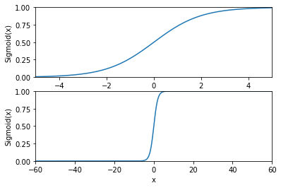
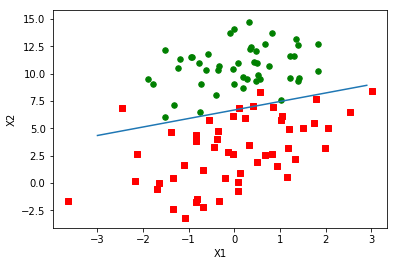

### 逻辑回归--LogicitisRegression


Sigmoid函数 $$s(z)=\cfrac{1}{1+e^{-z}}$$


```python
import numpy as np
def sigmoid(z):
    return 1.0/(1 + np.exp(-z))
```


```python
sigmoid(0),sigmoid(4), sigmoid(-4)
```


    (0.5, 0.98201379003790845, 0.017986209962091559)


```python
# 出自《机器学习实战》中Sigmoid函数的画图代码
import sys
from pylab import *

t = arange(-60.0, 60.3, 0.1)
s = 1/(1 + exp(-t))
ax = subplot(211)
ax.plot(t,s)
ax.axis([-5,5,0,1])
plt.xlabel('x')
plt.ylabel('Sigmoid(x)')
ax = subplot(212)
ax.plot(t,s)
ax.axis([-60,60,0,1])
plt.xlabel('x')
plt.ylabel('Sigmoid(x)')
show()
```





#### 使用梯度上升找到最佳参数
##### 伪码：
每个参数初始化为1

重复R次：

    计算整个数据的梯度
    使用alpha*gradient更新参数向量
    
返回参数向量

#### 准备数据


```python
def load_data_set():
    data_mat = [];
    label_mat = [];
    with open("testSet.txt") as f:
        for line in f.readlines():
            line_arr = line.strip().split()
            data_mat.append([1.0, float(line_arr[0]), float(line_arr[1])])
            label_mat.append(int(line_arr[2]))
    return data_mat, label_mat

```


```python
data_mat, label_mat = load_data_set()
```


```python
print(data_mat)
```

    [[1.0, -0.017612, 14.053064], [1.0, -1.395634, 4.662541], [1.0, -0.752157, 6.53862], [1.0, -1.322371, 7.152853], [1.0, 0.423363, 11.054677], [1.0, 0.406704, 7.067335], [1.0, 0.667394, 12.741452], [1.0, -2.46015, 6.866805], [1.0, 0.569411, 9.548755], [1.0, -0.026632, 10.427743], [1.0, 0.850433, 6.920334], [1.0, 1.347183, 13.1755], [1.0, 1.176813, 3.16702], [1.0, -1.781871, 9.097953], [1.0, -0.566606, 5.749003], [1.0, 0.931635, 1.589505], [1.0, -0.024205, 6.151823], [1.0, -0.036453, 2.690988], [1.0, -0.196949, 0.444165], [1.0, 1.014459, 5.754399], [1.0, 1.985298, 3.230619], [1.0, -1.693453, -0.55754], [1.0, -0.576525, 11.778922], [1.0, -0.346811, -1.67873], [1.0, -2.124484, 2.672471], [1.0, 1.217916, 9.597015], [1.0, -0.733928, 9.098687], [1.0, -3.642001, -1.618087], [1.0, 0.315985, 3.523953], [1.0, 1.416614, 9.619232], [1.0, -0.386323, 3.989286], [1.0, 0.556921, 8.294984], [1.0, 1.224863, 11.58736], [1.0, -1.347803, -2.406051], [1.0, 1.196604, 4.951851], [1.0, 0.275221, 9.543647], [1.0, 0.470575, 9.332488], [1.0, -1.889567, 9.542662], [1.0, -1.527893, 12.150579], [1.0, -1.185247, 11.309318], [1.0, -0.445678, 3.297303], [1.0, 1.042222, 6.105155], [1.0, -0.618787, 10.320986], [1.0, 1.152083, 0.548467], [1.0, 0.828534, 2.676045], [1.0, -1.237728, 10.549033], [1.0, -0.683565, -2.166125], [1.0, 0.229456, 5.921938], [1.0, -0.959885, 11.555336], [1.0, 0.492911, 10.993324], [1.0, 0.184992, 8.721488], [1.0, -0.355715, 10.325976], [1.0, -0.397822, 8.058397], [1.0, 0.824839, 13.730343], [1.0, 1.507278, 5.027866], [1.0, 0.099671, 6.835839], [1.0, -0.344008, 10.717485], [1.0, 1.785928, 7.718645], [1.0, -0.918801, 11.560217], [1.0, -0.364009, 4.7473], [1.0, -0.841722, 4.119083], [1.0, 0.490426, 1.960539], [1.0, -0.007194, 9.075792], [1.0, 0.356107, 12.447863], [1.0, 0.342578, 12.281162], [1.0, -0.810823, -1.466018], [1.0, 2.530777, 6.476801], [1.0, 1.296683, 11.607559], [1.0, 0.475487, 12.040035], [1.0, -0.783277, 11.009725], [1.0, 0.074798, 11.02365], [1.0, -1.337472, 0.468339], [1.0, -0.102781, 13.763651], [1.0, -0.147324, 2.874846], [1.0, 0.518389, 9.887035], [1.0, 1.015399, 7.571882], [1.0, -1.658086, -0.027255], [1.0, 1.319944, 2.171228], [1.0, 2.056216, 5.019981], [1.0, -0.851633, 4.375691], [1.0, -1.510047, 6.061992], [1.0, -1.076637, -3.181888], [1.0, 1.821096, 10.28399], [1.0, 3.01015, 8.401766], [1.0, -1.099458, 1.688274], [1.0, -0.834872, -1.733869], [1.0, -0.846637, 3.849075], [1.0, 1.400102, 12.628781], [1.0, 1.752842, 5.468166], [1.0, 0.078557, 0.059736], [1.0, 0.089392, -0.7153], [1.0, 1.825662, 12.693808], [1.0, 0.197445, 9.744638], [1.0, 0.126117, 0.922311], [1.0, -0.679797, 1.22053], [1.0, 0.677983, 2.556666], [1.0, 0.761349, 10.693862], [1.0, -2.168791, 0.143632], [1.0, 1.38861, 9.341997], [1.0, 0.317029, 14.739025]]
    


```python
print(label_mat)
```

    [0, 1, 0, 0, 0, 1, 0, 1, 0, 0, 1, 0, 1, 0, 1, 1, 1, 1, 1, 1, 1, 1, 0, 1, 1, 0, 0, 1, 1, 0, 1, 1, 0, 1, 1, 0, 0, 0, 0, 0, 1, 1, 0, 1, 1, 0, 1, 1, 0, 0, 0, 0, 0, 0, 1, 1, 0, 1, 0, 1, 1, 1, 0, 0, 0, 1, 1, 0, 0, 0, 0, 1, 0, 1, 0, 0, 1, 1, 1, 1, 0, 1, 0, 1, 1, 1, 1, 0, 1, 1, 1, 0, 0, 1, 1, 1, 0, 1, 0, 0]
    


```python
def gradAscent(data_mat, label_mat):
    data_matrix = np.mat(data_mat)
    label_matrix = np.mat(label_mat).transpose()
    m, n = np.shape(data_matrix)
    alpha = 0.001
    max_cycles = 500
    theta = np.ones((n,1))
    for i in range(max_cycles):
        h = sigmoid(data * theta)
        cost = label_matrix - h
        theta = theta + alpha * data_matrix.transpose() * cost
    return theta
```


```python
theta = gradAscent(data_mat, label_mat)
theta.getA()
```


    array([[ 4.12414349],
           [ 0.48007329],
           [-0.6168482 ]])


#### 画出决策分界


```python
data_arr = array(data_mat)
n = np.shape(data_arr)[0]
data_arr, n
```


    (array([[  1.00000000e+00,  -1.76120000e-02,   1.40530640e+01],
            [  1.00000000e+00,  -1.39563400e+00,   4.66254100e+00],
            [  1.00000000e+00,  -7.52157000e-01,   6.53862000e+00],
            [  1.00000000e+00,  -1.32237100e+00,   7.15285300e+00],
            [  1.00000000e+00,   4.23363000e-01,   1.10546770e+01],
            [  1.00000000e+00,   4.06704000e-01,   7.06733500e+00],
            [  1.00000000e+00,   6.67394000e-01,   1.27414520e+01],
            [  1.00000000e+00,  -2.46015000e+00,   6.86680500e+00],
            [  1.00000000e+00,   5.69411000e-01,   9.54875500e+00],
            [  1.00000000e+00,  -2.66320000e-02,   1.04277430e+01],
            [  1.00000000e+00,   8.50433000e-01,   6.92033400e+00],
            [  1.00000000e+00,   1.34718300e+00,   1.31755000e+01],
            [  1.00000000e+00,   1.17681300e+00,   3.16702000e+00],
            [  1.00000000e+00,  -1.78187100e+00,   9.09795300e+00],
            [  1.00000000e+00,  -5.66606000e-01,   5.74900300e+00],
            [  1.00000000e+00,   9.31635000e-01,   1.58950500e+00],
            [  1.00000000e+00,  -2.42050000e-02,   6.15182300e+00],
            [  1.00000000e+00,  -3.64530000e-02,   2.69098800e+00],
            [  1.00000000e+00,  -1.96949000e-01,   4.44165000e-01],
            [  1.00000000e+00,   1.01445900e+00,   5.75439900e+00],
            [  1.00000000e+00,   1.98529800e+00,   3.23061900e+00],
            [  1.00000000e+00,  -1.69345300e+00,  -5.57540000e-01],
            [  1.00000000e+00,  -5.76525000e-01,   1.17789220e+01],
            [  1.00000000e+00,  -3.46811000e-01,  -1.67873000e+00],
            [  1.00000000e+00,  -2.12448400e+00,   2.67247100e+00],
            [  1.00000000e+00,   1.21791600e+00,   9.59701500e+00],
            [  1.00000000e+00,  -7.33928000e-01,   9.09868700e+00],
            [  1.00000000e+00,  -3.64200100e+00,  -1.61808700e+00],
            [  1.00000000e+00,   3.15985000e-01,   3.52395300e+00],
            [  1.00000000e+00,   1.41661400e+00,   9.61923200e+00],
            [  1.00000000e+00,  -3.86323000e-01,   3.98928600e+00],
            [  1.00000000e+00,   5.56921000e-01,   8.29498400e+00],
            [  1.00000000e+00,   1.22486300e+00,   1.15873600e+01],
            [  1.00000000e+00,  -1.34780300e+00,  -2.40605100e+00],
            [  1.00000000e+00,   1.19660400e+00,   4.95185100e+00],
            [  1.00000000e+00,   2.75221000e-01,   9.54364700e+00],
            [  1.00000000e+00,   4.70575000e-01,   9.33248800e+00],
            [  1.00000000e+00,  -1.88956700e+00,   9.54266200e+00],
            [  1.00000000e+00,  -1.52789300e+00,   1.21505790e+01],
            [  1.00000000e+00,  -1.18524700e+00,   1.13093180e+01],
            [  1.00000000e+00,  -4.45678000e-01,   3.29730300e+00],
            [  1.00000000e+00,   1.04222200e+00,   6.10515500e+00],
            [  1.00000000e+00,  -6.18787000e-01,   1.03209860e+01],
            [  1.00000000e+00,   1.15208300e+00,   5.48467000e-01],
            [  1.00000000e+00,   8.28534000e-01,   2.67604500e+00],
            [  1.00000000e+00,  -1.23772800e+00,   1.05490330e+01],
            [  1.00000000e+00,  -6.83565000e-01,  -2.16612500e+00],
            [  1.00000000e+00,   2.29456000e-01,   5.92193800e+00],
            [  1.00000000e+00,  -9.59885000e-01,   1.15553360e+01],
            [  1.00000000e+00,   4.92911000e-01,   1.09933240e+01],
            [  1.00000000e+00,   1.84992000e-01,   8.72148800e+00],
            [  1.00000000e+00,  -3.55715000e-01,   1.03259760e+01],
            [  1.00000000e+00,  -3.97822000e-01,   8.05839700e+00],
            [  1.00000000e+00,   8.24839000e-01,   1.37303430e+01],
            [  1.00000000e+00,   1.50727800e+00,   5.02786600e+00],
            [  1.00000000e+00,   9.96710000e-02,   6.83583900e+00],
            [  1.00000000e+00,  -3.44008000e-01,   1.07174850e+01],
            [  1.00000000e+00,   1.78592800e+00,   7.71864500e+00],
            [  1.00000000e+00,  -9.18801000e-01,   1.15602170e+01],
            [  1.00000000e+00,  -3.64009000e-01,   4.74730000e+00],
            [  1.00000000e+00,  -8.41722000e-01,   4.11908300e+00],
            [  1.00000000e+00,   4.90426000e-01,   1.96053900e+00],
            [  1.00000000e+00,  -7.19400000e-03,   9.07579200e+00],
            [  1.00000000e+00,   3.56107000e-01,   1.24478630e+01],
            [  1.00000000e+00,   3.42578000e-01,   1.22811620e+01],
            [  1.00000000e+00,  -8.10823000e-01,  -1.46601800e+00],
            [  1.00000000e+00,   2.53077700e+00,   6.47680100e+00],
            [  1.00000000e+00,   1.29668300e+00,   1.16075590e+01],
            [  1.00000000e+00,   4.75487000e-01,   1.20400350e+01],
            [  1.00000000e+00,  -7.83277000e-01,   1.10097250e+01],
            [  1.00000000e+00,   7.47980000e-02,   1.10236500e+01],
            [  1.00000000e+00,  -1.33747200e+00,   4.68339000e-01],
            [  1.00000000e+00,  -1.02781000e-01,   1.37636510e+01],
            [  1.00000000e+00,  -1.47324000e-01,   2.87484600e+00],
            [  1.00000000e+00,   5.18389000e-01,   9.88703500e+00],
            [  1.00000000e+00,   1.01539900e+00,   7.57188200e+00],
            [  1.00000000e+00,  -1.65808600e+00,  -2.72550000e-02],
            [  1.00000000e+00,   1.31994400e+00,   2.17122800e+00],
            [  1.00000000e+00,   2.05621600e+00,   5.01998100e+00],
            [  1.00000000e+00,  -8.51633000e-01,   4.37569100e+00],
            [  1.00000000e+00,  -1.51004700e+00,   6.06199200e+00],
            [  1.00000000e+00,  -1.07663700e+00,  -3.18188800e+00],
            [  1.00000000e+00,   1.82109600e+00,   1.02839900e+01],
            [  1.00000000e+00,   3.01015000e+00,   8.40176600e+00],
            [  1.00000000e+00,  -1.09945800e+00,   1.68827400e+00],
            [  1.00000000e+00,  -8.34872000e-01,  -1.73386900e+00],
            [  1.00000000e+00,  -8.46637000e-01,   3.84907500e+00],
            [  1.00000000e+00,   1.40010200e+00,   1.26287810e+01],
            [  1.00000000e+00,   1.75284200e+00,   5.46816600e+00],
            [  1.00000000e+00,   7.85570000e-02,   5.97360000e-02],
            [  1.00000000e+00,   8.93920000e-02,  -7.15300000e-01],
            [  1.00000000e+00,   1.82566200e+00,   1.26938080e+01],
            [  1.00000000e+00,   1.97445000e-01,   9.74463800e+00],
            [  1.00000000e+00,   1.26117000e-01,   9.22311000e-01],
            [  1.00000000e+00,  -6.79797000e-01,   1.22053000e+00],
            [  1.00000000e+00,   6.77983000e-01,   2.55666600e+00],
            [  1.00000000e+00,   7.61349000e-01,   1.06938620e+01],
            [  1.00000000e+00,  -2.16879100e+00,   1.43632000e-01],
            [  1.00000000e+00,   1.38861000e+00,   9.34199700e+00],
            [  1.00000000e+00,   3.17029000e-01,   1.47390250e+01]]), 100)


```python
def plotBestFit(theta):
    import matplotlib.pyplot as plt
    data_mat, label_mat = load_data_set()
    data_arr = np.array(data_mat)
    n = np.shape(data_arr)[0]
    xcord1 = []
    ycord1 = []
    xcord2 = []
    ycord2 = []
    for i in range(n):
        if int(label_mat[i]) == 1:
            xcord1.append(data_arr[i,1])
            ycord1.append(data_arr[i,2])
        else:
            xcord2.append(data_arr[i,1])
            ycord2.append(data_arr[i,2])
    fig = plt.figure()
    ax = fig.add_subplot(111)
    ax.scatter(xcord1, ycord1, s=30, c="red", marker="s")
    ax.scatter(xcord2, ycord2, s=30, c="green")
    x = np.arange(-3.0, 3.0, 0.1)
    y = (-theta[0] - theta[1]*x) / theta[2]
    ax.plot(x, y)
    plt.xlabel('X1')
    plt.ylabel('X2')
    plt.show()
    
    
```


```python
plotBestFit(theta.getA())
```




